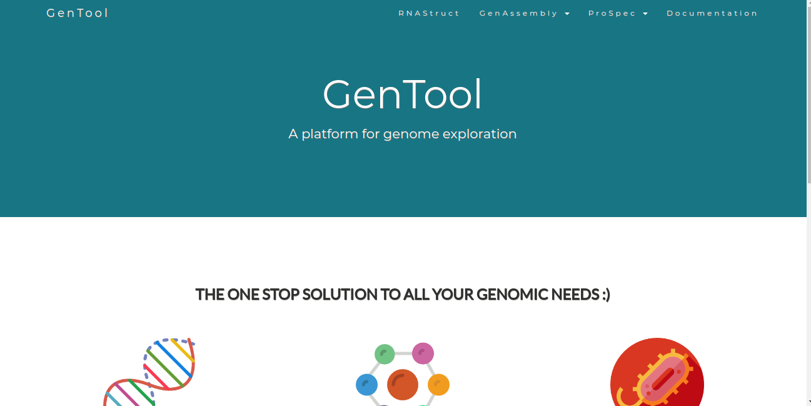

# Learning Flask 
Flask is a python based web framework. It's easy to learn and helps you build static webpages really quickly. 

So, I built a basic static website using Flask. This repository has two main folders, one related to the static website and the other contains codes pertaining to flask tutorials. 

### Tutorials

So, my main objective of learning Flask was to make a basic website for my biology project. There are a lot of good resources to get started with Flask. But I highly recommend to start with the tutorials put together by [thenewboston](https://www.youtube.com/watch?v=ZVGwqnjOKjk).

### The genome app

The website is an interface to three bioinformatics algorithms:
* GenAssembly
  * String assembler
  * Graph assembler (DeBruijn Graph)

* ProSpec
  * Inferring spectrum from proteins
  * Finding similar proteins
  
* RNAStruct
  * RNA secondary structure prediction.

## Prerequistes

Make sure you have python and flask installed.

`pip install flask`

## Up and Running

* Tutorials

`python filename.py`

* The genome app

`python main.py`

